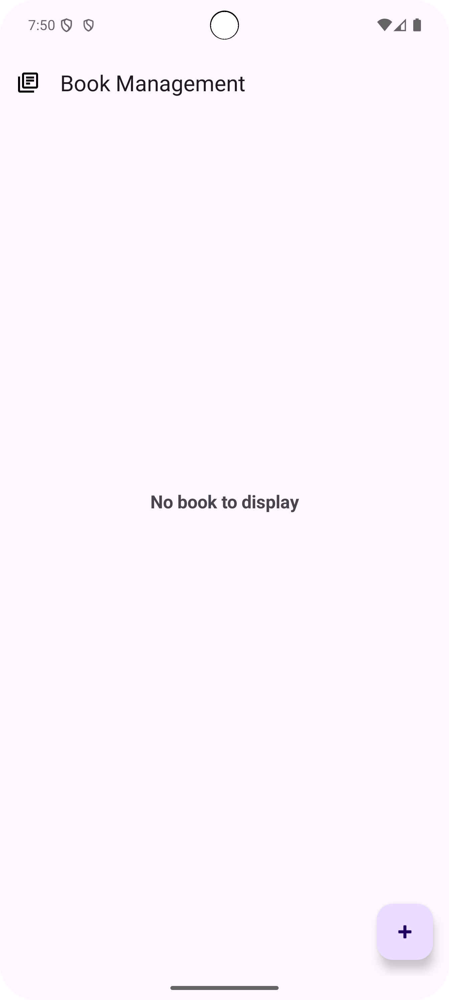
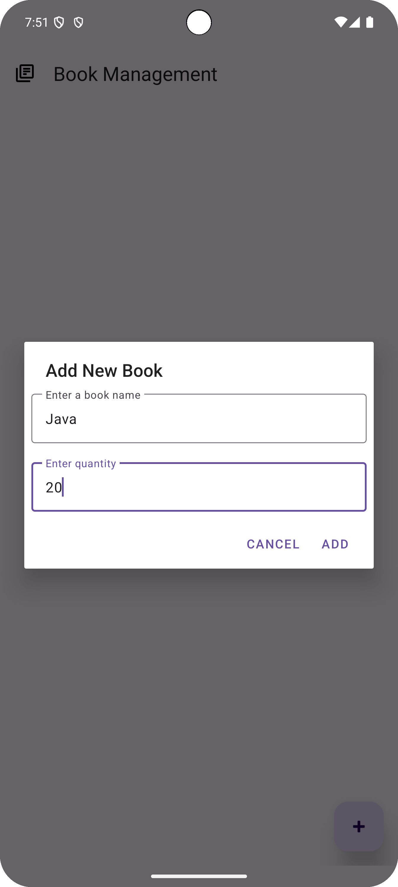
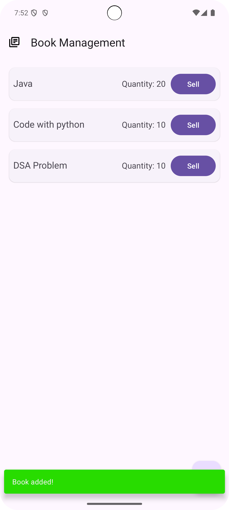
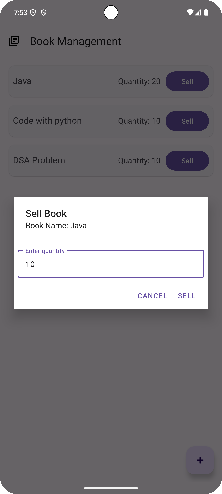

---

# 📚 Book Management App

A simple **Android Book Management App** built using **Java**, **RecyclerView**, and **Material Design**. Users can **add, sell, and remove books**, with stock management and Snackbar notifications.

## ✨ Features
- 📖 **Add new books** with name and quantity.
- 🛒 **Sell books** by selecting quantity.
- ❌ **Auto-remove books** when stock reaches zero.
- 🎨 **Material Design UI** with **Snackbar notifications**.
- 🔄 **RecyclerView with real-time updates**.

## 📷 Screenshots
### Home Screen
 

### Add Book Screen
  

### Book List Screen
  

### Sell Book Screen
  


---
Download APK

Download the latest APK from the following link:  
[Download APK](apk/book_v1.apk)

---

## 🛠 Tech Stack
- **Language:** Java
- **UI Components:** RecyclerView, Material Design, AlertDialog
- **State Management:** RecyclerView Adapter

## 📂 Project Structure
```
📂 BookManagementApp/
├── 📂 app/
│   ├── 📂 src/
│   │   ├── 📂 main/
│   │   │   ├── 📂 java/com/example/bookmanagement/
│   │   │   │   ├── 📂 adapter/ (RecyclerView Adapter)
│   │   │   │   ├── 📂 model/ (Book Model)
│   │   │   │   ├── MainActivity.java
│   │   │   ├── 📂 res/
│   │   │   │   ├── 📂 layout/ (XML files)
│   │   │   │   ├── 📂 drawable/ (Icons)
│   │   │   │   ├── 📂 values/ (Colors, Strings)
```

## 🚀 Getting Started

### 1️⃣ Clone the Repository
```bash
git clone https://github.com/your-username/BookManagementApp.git
```

### 2️⃣ Open in Android Studio
- Open **Android Studio**
- Select **"Open an Existing Project"**
- Navigate to the cloned folder

### 3️⃣ Run the App
- Connect an **Android device** or use an **emulator**
- Click **Run ▶️**

## 📝 How It Works
1️⃣ **Add a Book**
- Click the **➕ Floating Action Button**
- Enter **Book Name & Quantity**
- Click **"Add"**

2️⃣ **Sell a Book**
- Click **"Sell"** on a book
- Enter **quantity to sell**
- Click **"Sell"**
- If stock reaches **0**, the book **Get Remove**

3️⃣ **Empty State**
- If **no books exist**, **"No book to display"** message appears

---
